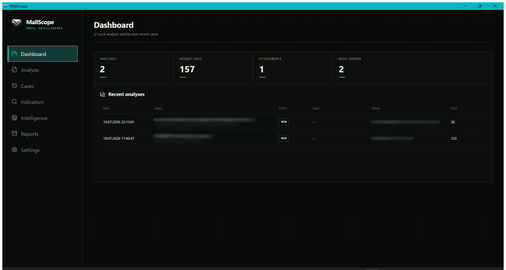
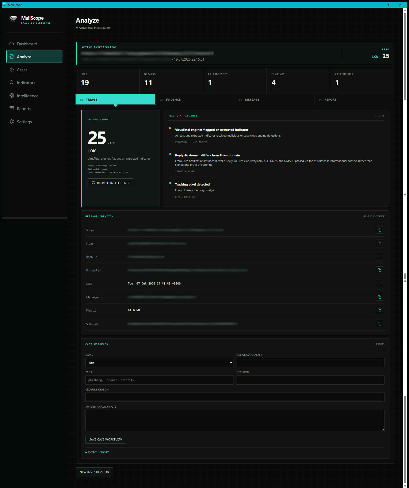
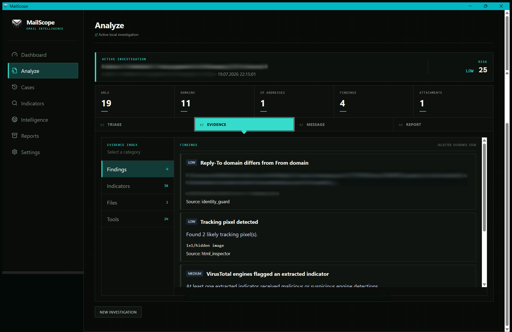
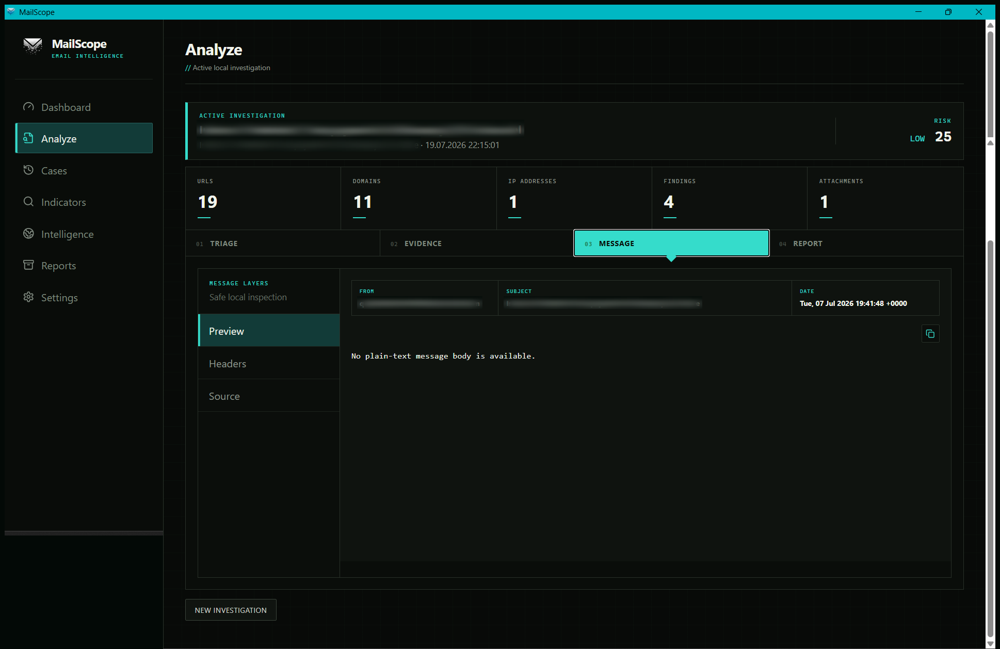
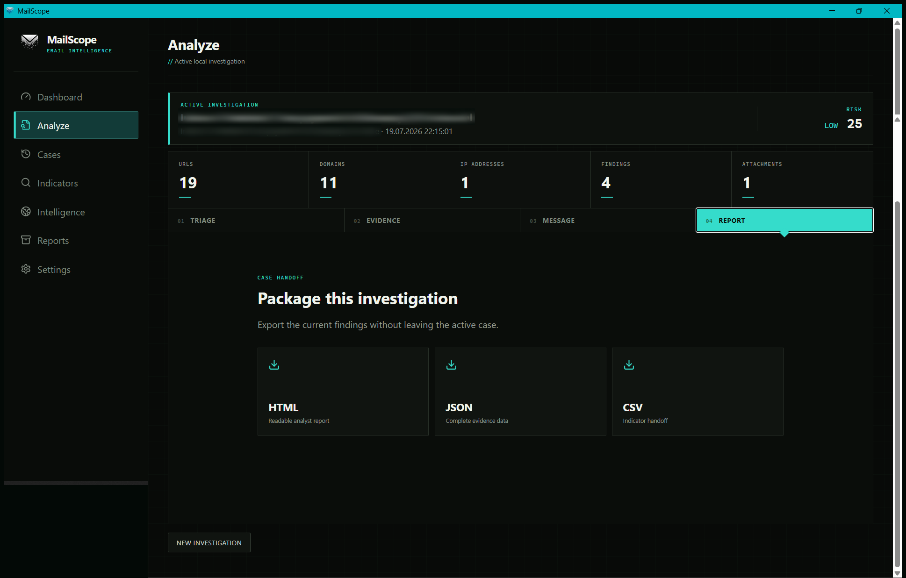
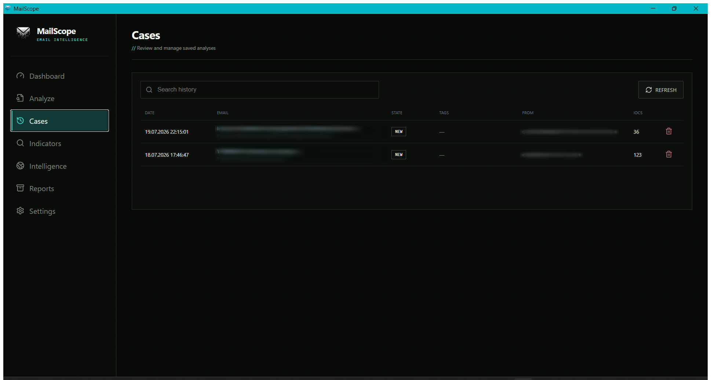
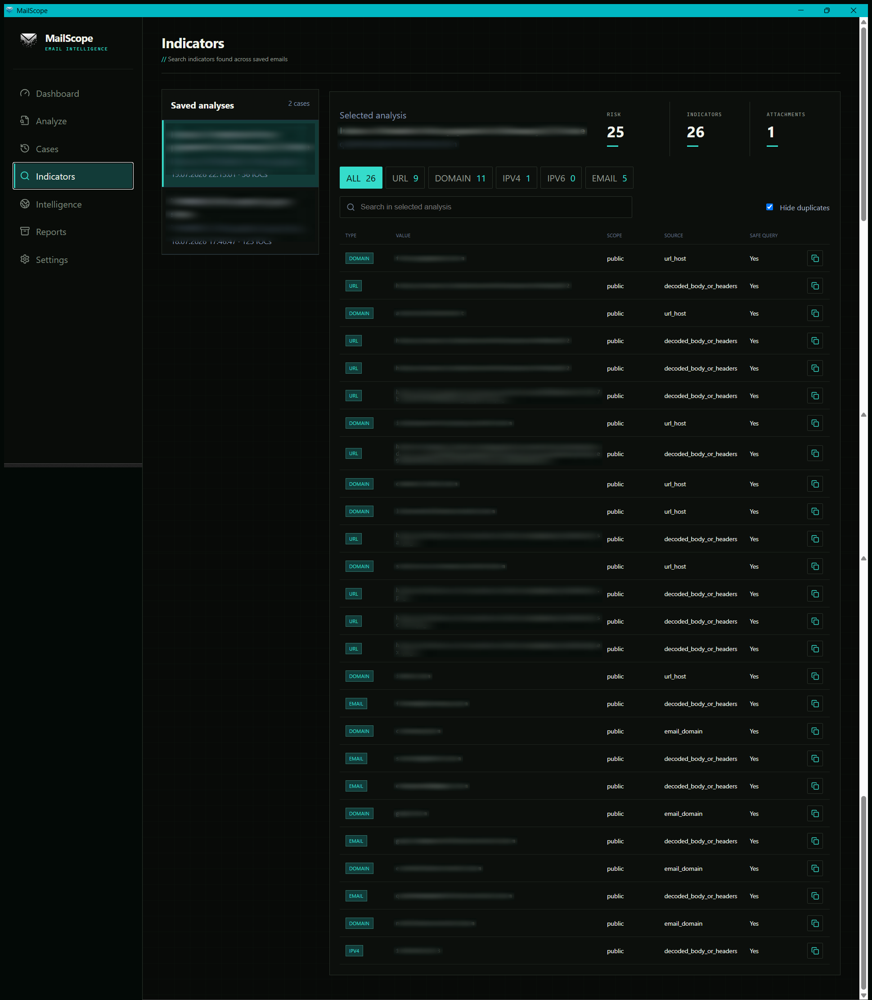
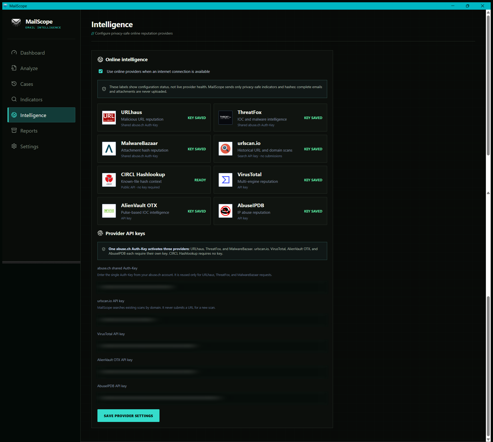
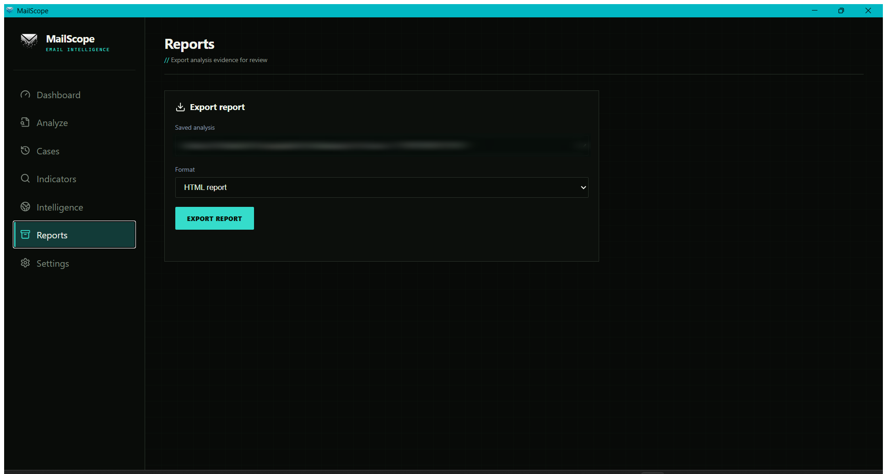
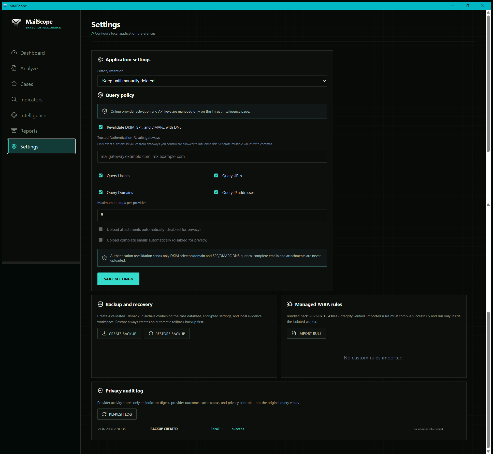

# MailScope v1.1.0

Privacy-first Windows email intelligence desktop application using Tauri, React, Python and SQLite.

## Screenshots

The gallery uses selectively redacted local test data. Navigation, analysis findings, risk scores, provider status and report controls remain visible; email identities, indicator values and API keys are blurred.

<strong>Dashboard</strong> — activity totals and recent investigations

<strong>Analyze: Triage</strong> — verdict, priority findings, message identity and case workflow

<strong>Analyze: Evidence</strong> — findings, indicators, files and tool output

<strong>Analyze: Message</strong> — safe preview, headers and source inspection

<strong>Analyze: Report</strong> — investigation export formats

<strong>Cases</strong> — saved investigation history

<strong>Indicators</strong> — normalized IOC inventory with provenance and safe-query status

<strong>Intelligence</strong> — online reputation providers and credential configuration

<strong>Reports</strong> — saved-analysis report export

<strong>Settings</strong> — retention, query policy, backup, YARA and privacy auditing

## Build
Extract the ZIP into a clean folder and run `Build-MailScope.cmd`.

The repository does not store third-party executable binaries. During setup, `scripts\download-soc-tools.ps1` downloads the pinned official capa, FLOSS and ExifTool archives, verifies their SHA-256 values from `engine\tools\manifest.json`, extracts only the required runtime files, and verifies each executable again before build.

## Offline analysis
MIME/header analysis, IOC extraction, hashes, managed YARA rule-pack scanning, PDF, Office and PE static inspection. Attachments are parsed in a separate worker process with a 768 MiB process limit, a 240-second wall timeout and an 8 MiB output cap. On Windows the worker tree is contained by a Job Object and is killed as a unit when a limit is reached.

PDF embedded files, ZIP/GZIP archives, Office package embeddings and OLE `Ole10Native` objects are recursively extracted to a maximum depth of 3. Extraction is bounded to 50 files, 50 MiB total expanded data, 20 MiB per file and a 200:1 compression ratio. Encrypted, unsupported, timed-out and safety-blocked objects are reported explicitly instead of being labelled clean.

The bundled YARA rules are categorized, versioned and checked against a SHA-256 manifest before compilation. Custom `.yar`/`.yara` files can be compiled, imported, versioned, disabled and rolled back from Settings. Verified Windows builds of ExifTool 13.59, capa 9.4.0 and FLOSS 3.1.1 are bundled with the application; no separate installation or PATH configuration is required.

## Online intelligence
When enabled and internet is available, MailScope can perform indicator/hash lookups through URLhaus, ThreatFox and MalwareBazaar using one shared abuse.ch Auth-Key. urlscan.io uses its own API key in search-only mode; MailScope searches historical domain scans and never submits a URL for scanning. CIRCL Hashlookup checks attachment SHA-256 values against known-file datasets without an API key. VirusTotal, AlienVault OTX and AbuseIPDB use their own API keys. Keys are entered only on the Threat Intelligence page and are protected for the current Windows user with DPAPI.

MailScope separates untrusted Authentication-Results header claims from DNS-backed revalidation. DKIM signatures are cryptographically verified against DNS public keys, SPF is re-evaluated when recorded SMTP client IP and envelope-sender evidence is available, and DMARC policy discovery/alignment follows RFC 9989. DNS revalidation can be disabled in Settings.

MailScope does not automatically upload full emails or attachments. Those upload options are hard-disabled in this release.

Each URL, domain, IP and hash query permission is enforced for every provider. Provider results use a bounded local TTL cache and every live/cache outcome is written to a privacy audit log using only a one-way indicator digest. Original URL credentials and tracking query parameters are not stored in the cache or audit log. Analysis history can be retained indefinitely or automatically pruned after 30 or 90 days; pruning also removes extracted attachment workspaces.

## Cases, reports and recovery

Each unique email SHA-256 maps to one saved analysis and one case workflow. Analysts can assign a state, owner, tags, decision, closure reason and append-only notes. HTML reports include the risk-model version, capped category contribution, attachment lineage and analysis status, provider/cache coverage, upload counts and case event history.

Settings can create and restore validated `.msbackup` archives containing SQLite data, DPAPI-protected settings and the local evidence workspace. Restore checks member paths, compression ratios, content hashes and SQLite integrity, and creates an automatic rollback backup before replacing live data.

## SOC deployment notes

MailScope is designed as a Windows analyst triage workstation: it parses messages and attachments statically and never executes an attachment. Bundled tool integrity is checked with SHA-256, API credentials are protected at rest with the current Windows user's DPAPI identity, external-tool output is capped at 8 MiB, and capa/FLOSS processes are limited to 180 seconds per PE file.

Before enterprise deployment, sign both the application and installer with the organization's trusted code-signing certificate, distribute through a managed software channel, and validate outbound provider access against the organization's data-handling policy. Set `MAILSCOPE_SIGN_CERT_THUMBPRINT` before running `scripts\build.ps1`; the build fails if signing or signature verification fails. Every build also emits `SHA256SUMS.txt` and `release-manifest.json`.

MailScope is a full static email-triage workstation, but it does not execute suspicious content. It does not replace an isolated malware sandbox, EDR, SIEM, enterprise case-management platform, or mail-gateway quarantine product.
